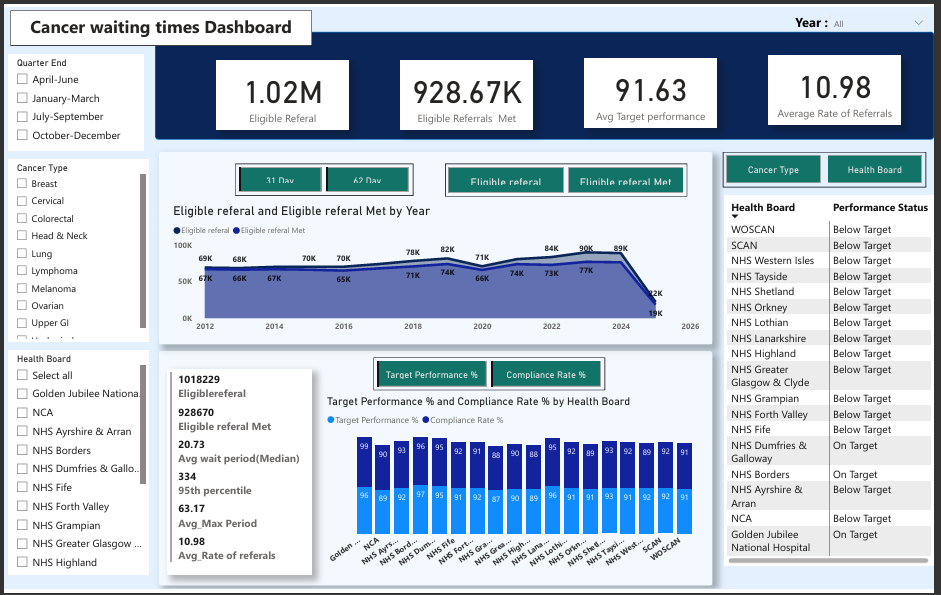

# Scotland-Cancer-Waiting-Times

## Introduction
This project aims to analyse cancer patient waiting times across NHS Scotland by evaluating the performance of each health board and cancer type category. 
The data is collected to monitor compliance with the Scottish Government's cancer waiting time standards. 
It provides data-driven insights through visualisations and offers actionable solutions based on the findings.

The dataset used in this project was obtained from the [Public Health Scotland website](https://www.publichealthscotland.scot/publications/cancer-waiting-times/cancer-waiting-times-1-april-to-30-june-2025/), a reputable and reliable source that ensures the authenticity and credibility of the data.
The data focuses on two National standards. i.e 31-day waiting times and 62-day waiting times.

The **31-day standard** is for patients, regardless of the route of referral, from the date the decision to treat is made to first cancer treatment.
The **62-day standard** is for patients urgently referred with a suspicion of cancer to first cancer treatment.

## Problem statement
In  this project, we will be looking at the:

A. Overall Performance Overview
  1. Average performance for 31‑day and 62‑day targets.
  2. Total referrals and total referrals meeting targets.

B. Health Board Summary
  1. Performance ranking of all health boards.
  2. Boards consistently above/below target.
  3. Referral volume differences across boards.

C. Cancer Type Summary
  1. Which cancer types have the highest/lowest performance?
  2. Cancer types with the longest waiting times.

D. Time‑Series Analysis (How is it changing over time?)
  1. Performance trend over time for each target type (Quarterly, Seasonal Patterns).
  2. Long‑term improvement or decline.
  3. Identify years with major performance drops (Year‑on‑Year Comparison).

E. Waiting Time Distribution Analysis (How long are patients waiting?)
  Using Median, Max, and 95th Percentile:
  1. Compare typical waiting times across boards.
  2. Identify extreme delays (max values).
